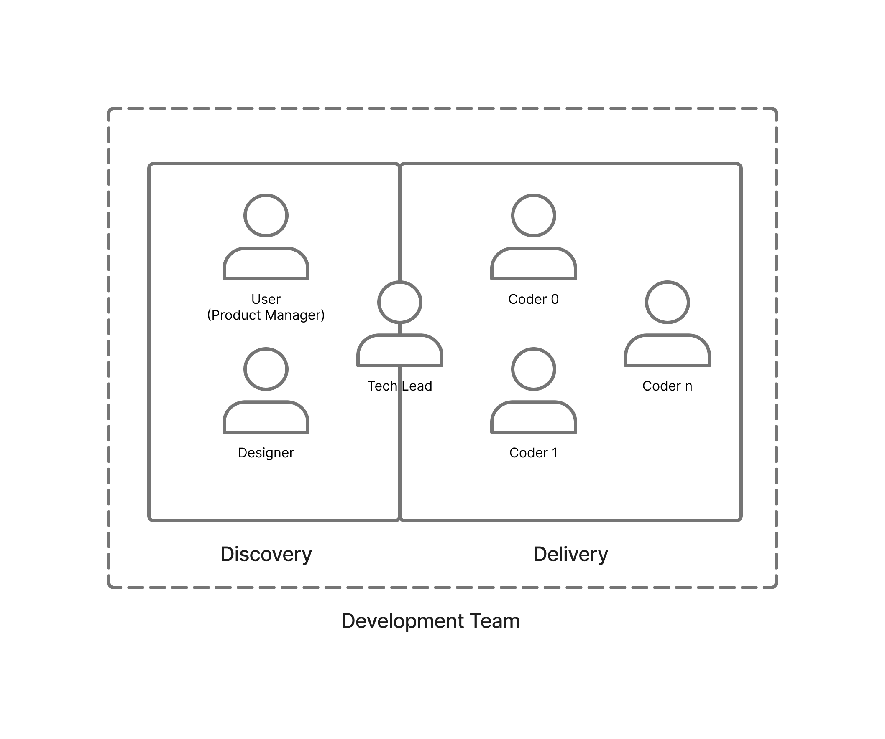

# Dual-Track Development Plugin

Agents trained to build products using Patton and Cagan's dual-track development framework.

## Premise

Agents are very good at delivery. Hand one a clear specification and it will produce working, tested,
reviewed code faster than any team of humans. That capability makes the underlying problem worse
rather than better: the constraint on product work was never typing speed, it was knowing what
deserved to be built. An agent that can build anything will cheerfully build the wrong thing, and it
will get there before anyone has thought to ask.

Dual-track development is the answer product teams already found. Marty Cagan's observation is that
most product ideas fail, and the ones that survive do so because someone tested them cheaply before
committing engineering to them. Jeff Patton's is that the point of the exercise is shared
understanding, not documents — a story map is valuable because of the conversation that produces it.
So the work splits into two tracks that run continuously and in parallel, staffed by one team:
**discovery** decides what is worth building, **delivery** builds it well. Neither pauses for the
other.

This plugin puts an agent team on both tracks, with one seat reserved. **You are the Product
Manager.** The plugin does not simulate one, because the risks a PM owns — is this valuable, is it
viable for the business — turn on judgment about real customers and a real market that no agent has
access to.

### You are in the room, not on the other side of a wall

This is the part that differs most from how agent teams usually work, so it is worth being blunt
about.

The common pattern is hub-and-spoke: you talk to a lead agent, the lead agent talks to specialists,
and everything you say reaches them as the lead's summary of what you meant. That is a reasonable
default for execution work. It is the wrong shape for discovery, because the thing discovery is
trying to produce *is* shared understanding — and a summary is exactly where shared understanding
goes to die. If the designer only ever hears your intent secondhand, the designer is designing
against the tech-lead's interpretation of you.

So discovery is a **group discussion**. You, the tech-lead, and the designer are all in the same
conversation, reading the same words. The tech-lead facilitates and keeps the thread moving, but it
does not stand between you and the designer, and it does not paraphrase one participant to another.
The designer can ask you a question directly and read your answer in your own words.

Delivery is the opposite, and deliberately so. There the tech-lead **is** the single point of
contact — it translates validated intent into work orders, dispatches coders, and reconciles what
comes back. Coders do not join the discussion. That translation is the value the tech-lead adds on
the delivery side, and it is why the same agent sits on both tracks.

| Track     | Shape                | Why                                                                  |
| --------- | -------------------- | -------------------------------------------------------------------- |
| Discovery | Group discussion     | Shared understanding is the output; summaries destroy it.             |
| Delivery  | Single point of contact | Coders need unambiguous, self-contained work, not open questions.  |

## The Development Team



Cagan names four risks every product idea has to survive. The team is organized around who owns
each one:

| Member                     | Track                | Primary risk     | Responsibility                                                             |
| -------------------------- | -------------------- | ---------------- | -------------------------------------------------------------------------- |
| **User** (Product Manager) | Discovery            | Value, viability | Decides what is worth building. The only member who can validate a bet.     |
| **designer**               | Discovery            | Usability        | All interaction and visual design. Produces the prototype discovery tests.  |
| **tech-lead**              | Discovery + Delivery | Feasibility      | Facilitates discovery. Translates validated intent into buildable work.     |
| **coder** (0..n)           | Delivery             | —                | Implementation. Runs in parallel across independent slices.                 |

`tech-lead` is the only member seated on both tracks, and it wears a different hat on each. In
discovery it is a participant and facilitator among equals, keeping feasibility honest while options
are still cheap to change. In delivery it is the hub. It is also the entry point — you start a
session by talking to the tech-lead, not by dispatching agents yourself.

Delivery fans out. `coder` is a role, not a single agent: the tech-lead slices validated work into
independent units and runs as many coders as the slices allow, then reconciles the results.

### Shared context

Every agent on the team loads the same skill, `dual-track:dual-track`. It carries the parts of this
document the agents actually need at runtime — the roster, the artifact contract, the discussion
protocol, the validation gate — so that all three roles share one definition of how the team
operates. Agent definitions reference it explicitly and then add only what is specific to their
role. When a protocol changes, it changes in one place.

| Agent       | Model   | Skills beyond `dual-track:dual-track`                                                |
| ----------- | ------- | ------------------------------------------------------------------------------------ |
| `tech-lead` | inherit | —                                                                                     |
| `designer`  | opus    | `frontend-design`, `figma:figma-use`, `figma:figma-generate-design`, `figma:figma-generate-library` |
| `coder`     | sonnet  | `coding:style-guide-typescript`, `coding:writing-tests-vitest`, `figma:figma-design-to-code` |

## Discovery

Discovery's job is to reduce the cost of being wrong. It runs a loop, and the loop is cheap on
purpose — every step before the last one is disposable.

### The discussion log

The group discussion needs somewhere to live, because agents do not share a conversation the way
people in a room do. The team keeps an **append-only discussion log** — one markdown file per
opportunity, structured as a group chat.

```markdown
## [0007] designer → @user

I explored three approaches to the import step. The one I'd push for
drops the preview entirely — but that assumes people trust the mapping
without seeing it first. Do they?

## [0008] user → @designer

They don't. Last two support escalations were both bad column mapping.

## [0009] tech-lead → @all

**DECISION** — preview stays. Designer to explore making it skippable
after first successful import.
```

The rules that make this a conversation rather than a relay:

- **Read the whole log before you write.** Every participant, every time.
- **Append only.** Never edit or delete an entry, including your own. Changed your mind? Append.
- **Address your entry.** `→ @user`, `→ @designer`, `→ @all`.
- **Quote, don't paraphrase.** When you refer to what another participant said, quote it. The
  tech-lead enters your words verbatim and attributes them to `user` — it never summarizes you to
  the designer.
- **Mark decisions and validations.** `**DECISION**` when the group settles something,
  `**VALIDATED**` when you approve a prototype. These are the entries the rest of the process reads.

You can type into the session and let the tech-lead append for you, or edit the log directly. Both
work.

### The loop

1. **Frame the opportunity.** The team states the problem, who has it, and what would have to be
   true for solving it to matter. Ideas arrive as solutions; this step recovers the problem
   underneath.
2. **Map the journey.** The group builds a story map — the narrative flow of what a person is
   trying to accomplish, laid out left to right, with alternatives and details hanging below. The
   map keeps the team arguing about the whole experience instead of a feature.
3. **Explore solutions.** The designer works the solution space broadly before committing — several
   approaches, deliberately different, judged against the mapped journey rather than against each
   other. Exploration is posted to the log, where you and the tech-lead react to it directly.
4. **Prototype.** The designer builds the chosen direction as high-fidelity Figma mockups. This is
   the artifact discovery exists to produce, and it is described in detail below.
5. **Validate.** You review the prototype and decide. This is the gate: value and viability are
   yours to rule on, usability is what the prototype makes visible, and the tech-lead has been
   pressure-testing feasibility throughout. An idea that fails here costs a prototype, not a
   release.
6. **Slice.** Validated work is cut into thin vertical slices along the story map — each one a
   walkable path through the journey rather than a horizontal layer. Slices are what delivery
   consumes.

The loop does not run once. Delivery is building slice *n* while discovery is validating slice
*n+1*, which is the entire reason the tracks are separate.

## Delivery

Delivery's job is to build validated work well, and to stay faithful to what was validated. Here the
tech-lead is the single point of contact, and the shape is a hub.

You and the designer talk to the tech-lead. The tech-lead talks to the coders. Coders do not read
the discussion log, do not talk to each other, and do not talk to you — they receive a **work
order** that is complete on its own: the slice, the Figma node it implements, the acceptance
criteria, and the repository conventions that apply.

That constraint is doing real work. An open question inside a coder is a guess waiting to happen,
and a guess inside delivery is how a team ships something nobody validated. So coders escalate
rather than interpret. If a slice turns out to be underspecified, ambiguous, or infeasible as
designed, it goes back to the tech-lead — and if it touches what a person experiences, the tech-lead
takes it back into the discussion log where you and the designer can rule on it.

`coding:style-guide-typescript` and `coding:writing-tests-vitest` are attached to the coder role
precisely so that "well" has a definition that does not depend on the tech-lead remembering to state
it in every work order.

The tech-lead reconciles completed slices, verifies the result against the prototype, and reports
back to the discussion log.

## The Artifacts

The tracks are connected by a small set of artifacts. This is the contract: discovery is done when
these exist, delivery works from nothing else.

| Artifact                | Author            | Consumers              | Form                                    |
| ----------------------- | ----------------- | ---------------------- | --------------------------------------- |
| **Discussion log**      | discovery team    | discovery team         | `docs/discovery/<name>/discussion.md`   |
| **Opportunity brief**   | tech-lead         | designer, tech-lead    | `docs/discovery/<name>/brief.md`        |
| **Story map**           | tech-lead         | designer, tech-lead    | `docs/discovery/<name>/story-map.md`    |
| **Validated prototype** | designer          | user, tech-lead, coder | Figma file, URL recorded in the brief   |
| **Sliced backlog**      | tech-lead         | coder                  | `docs/discovery/<name>/slices.md`       |
| **Work order**          | tech-lead         | one coder              | Prompt to the coder, cites the above    |

The discussion log is the raw material; the brief, story map, and slices are the durable
distillations the tech-lead maintains from it. When they disagree, the log is the record of what was
actually decided.

### The validated prototype

The prototype is the load-bearing artifact, and it is deliberately not a document. It is a set of
high-fidelity Figma mockups, authored by the designer and consumed by everyone else through the
`figma` plugin.

**The designer authors it.** Working from the story map, the designer builds real screens in Figma —
`figma-generate-design` for composing views, `figma-use` for the underlying write operations. It
builds on whatever design system the project already has: existing components, variables, and Code
Connect mappings are discovered first and reused, so the prototype is expressed in the project's own
vocabulary rather than in detached rectangles. Where no design system exists yet,
`figma-generate-library` establishes the tokens and components before screens are composed on top of
them.

**You and the tech-lead validate against it.** Review happens on the real thing — `get_screenshot`
for looking, the live file for clicking through. High fidelity is the requirement, not a
nice-to-have: usability risk is only visible when the artifact is close enough to the real product
that reacting to it means something. A wireframe validates that a screen has the right boxes; it
cannot tell you whether the flow is comprehensible.

**Coders build from it.** Implementation reads the design through `figma-design-to-code` and
`get_design_context`, which return structured design data — component structure, variable bindings,
spacing, and Code Connect mappings to existing code components — rather than a picture to eyeball.
The distinction matters: the coder is not reproducing an image, it is instantiating the same
components and tokens the designer composed with. Design drift stops being a discipline problem and
becomes a mechanical one.

**The loop closes.** As components get built, `add_code_connect_map` records the mapping from Figma
component to code component. The next round of discovery starts from a design system that knows what
already exists, and prototypes get cheaper each time.

The prototype is the specification. Where prose in the brief and the Figma file disagree about what a
person sees, the Figma file wins.

## A Session

> Outline — to be drafted.

- **Setup.** Launching a session with the tech-lead as entry point; what the tech-lead establishes
  about the project before any product work starts.
- **Opening the opportunity.** The framing conversation in the log, and what a completed brief looks
  like for a small, concrete feature.
- **Mapping.** Building the story map as a group; where the user pushes back and what changes.
- **Designer joins the discussion.** The designer reading in, posting exploration to the log, and
  asking the user a question directly — showing the group shape rather than a handoff.
- **The prototype.** Designer builds in Figma; the review cycle; a round of revision driven by
  something the mockups made visible. Ends with a `**VALIDATED**` entry.
- **Slicing.** Cutting the validated design into vertical slices; what makes a slice independent.
- **Delivery.** The shape changes: tech-lead writes work orders and fans out to coders; a coder
  implementing one slice from Figma design context; one escalation that goes back to the log.
- **The next turn of the loop.** Discovery already working on slice *n+1* while delivery finishes
  *n*.

## Installation

### Prerequisites

The `figma` plugin is required, not optional — the validated prototype lives in Figma and both the
designer and the coders reach it through that plugin's MCP server. Without it the designer cannot
author a prototype and coders have nothing to build from.

The `coding` plugin supplies the skills attached to the `coder` role. It ships from this same
marketplace.

### From the marketplace

```shell
/plugins marketplace add stickshift/agents
/plugins enable dual-track@stickshift
/plugins enable coding@stickshift
```

### From a local clone

```shell
# Path to local repo clone
SS_AGENTS_HOME=...
```

```shell
# Configure cli opts
CLAUDE_OPTS=(
  --plugin-dir "${SS_AGENTS_HOME}/plugins/dual-track"
  --agent dual-track:tech-lead
)

# Launch claude
claude "${CLAUDE_OPTS[@]}"
```

`--agent dual-track:tech-lead` is the part that matters. The tech-lead is the entry point: it holds
the context that spans both tracks and dispatches the rest of the team. Starting a session against
the designer or a coder directly skips discovery, which is the one thing this plugin exists to
prevent.

## What This Isn't

**Not a project management tool.** There are no sprints, points, velocity, or burndown. The
artifacts exist to carry understanding between the tracks, not to report on the team.

**Not a substitute for talking to real users.** Discovery here reduces the cost of being wrong about
what you already suspect; it cannot tell you what customers want. The agents will validate a
prototype against your judgment, and your judgment is only as good as your contact with the people
you are building for. This plugin makes that contact more valuable, not less necessary.

**Not a simulated product manager.** The PM seat is yours and stays yours. Agents that role-play
product judgment produce confident answers to questions no one has the standing to answer, which is
worse than no answer.

**Not a design tool.** The designer agent composes in Figma using the design system it finds. It is
not a replacement for a designer with taste and a point of view — it is a way to get a
high-fidelity, buildable prototype in front of you fast enough that being wrong is cheap.

**Not autonomous.** Discovery blocks on you at the validation gate by construction. A session that
runs start to finish without your input has skipped the only step that makes the rest worthwhile.
