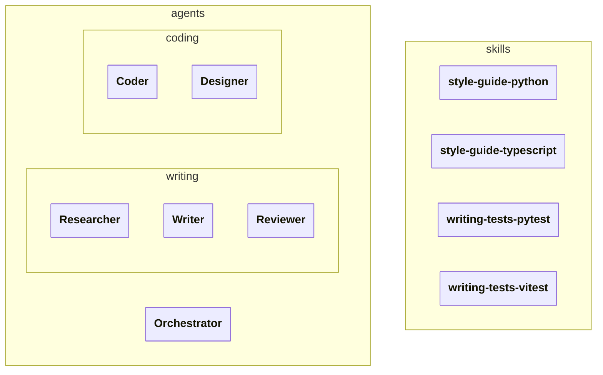

# Stickshift Plugin

Custom library of agentic guidance artifacts: skills, roles, hooks, etc.

## Roles

```mermaid
---
config:
  class:
    hideEmptyMembersBox: true
---
classDiagram

    namespace agents {
        class Orchestrator {
            
        }
    }

    namespace agents.coding {
        class Coder {
            
        }

        class Designer {
            
        }
    }

    namespace agents.writing {

        class Researcher {
            
        }

        class Writer {
            
        }

        class Reviewer {
            
        }
    }

    namespace skills {
        
        class style-guide-python {
            
        }

        class style-guide-typescript {
            
        }

        class writing-tests-pytest {
            
        }

        class writing-tests-vitest {
            
        }

    }

```